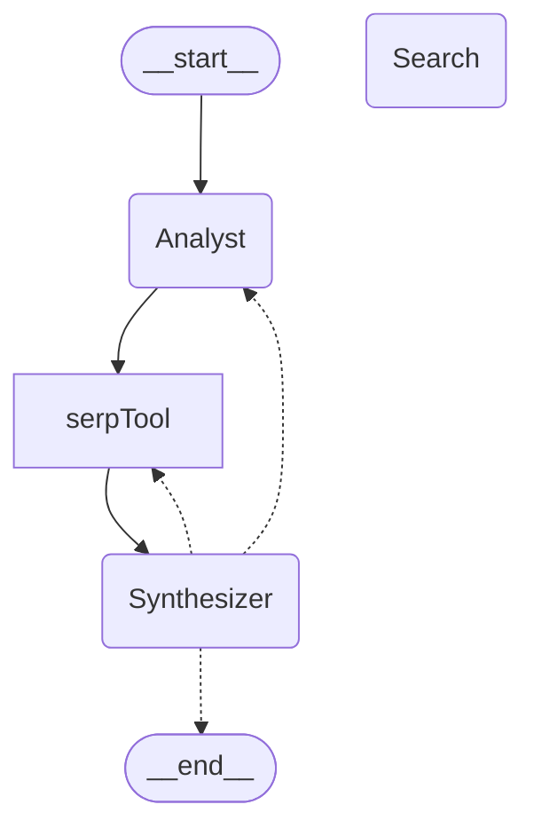

# swarmPlan2Serp
A Plan-and-excute(search) demo with OpenAI Swarm and FastHTML.

- <strong>No function-call feature required.</strong>
- Use any LLM api that follows the OpenAI format.



## Usage

1. Copy .env_example to .env and fill out the necessary information.
2. Run ```poetry install```
3. Run ```poetry run python app.py```

## Support

[](https://www.paypal.com/paypalme/franklin755)